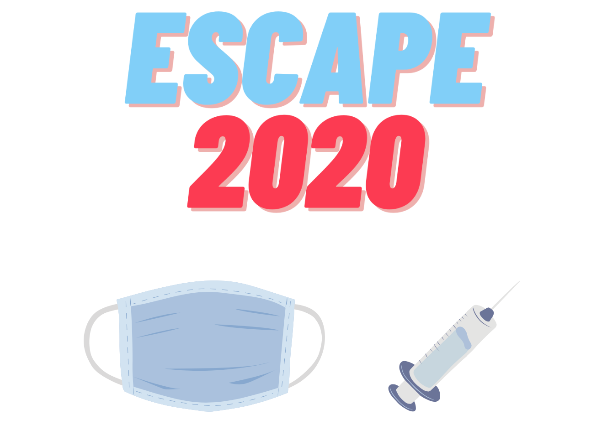

# Escape 2020
A story-based game. Can you open the vaccine center and avoid getting COVID?

Allegheny College Ethics Technical Leaders - Mozilla Grant

*Day-one Contributors:* Christian Lussier & Dr. Bonham-Carter

## About
Escape 2020 is a story-based game, where players are vaccine center managers and must get to the center on time without contracting the virus. There are a number of randomized scenarios and story events that are based on user responses to story-based prompts given throughout the game. One idea the game focuses upon is that of wearing a mask and the implications of what happens when people don't. Not only can forgoing a mask be detrimental to ones own health, but it can also impact those around them as the virus can spread with ease.

## Features
Escape 2020 is a game and with this there are a few key features it offers:
- Command-line interface
   - Color class to enhance the visual experience
- Welcome message with directions
- Story-based game implementation
   - Randomized story events and scenarios

## Installation

## Running the Game

## Related Research

## Ethical Discussions
The COVID-19 pandemic has brought up many new issues and discussions in the area of ethics. The biggest ethical problem COVID-19 has brought about is that of wearing a mask. There are those who do not want to wear a mask, claiming the virus is a hoax or that a mask won't protect them. Then there are those who wear masks. Are you an unethical person if you don't wear a mask? Some might say yes. Not only do you have a higher risk of getting the virus yourself, but you also could spread it others, most importantly the high-risk population. That doesn't seem very ethical. Wearing a mask is the ethical thing to do, because it helps keep everyone safe.

A similar discussion could arise in the area of vaccines. What are the ethical societal implications that come with choosing to get or skip the vaccine?

## Future Work
There are a number of different tasks

## Contributing

## Contact
